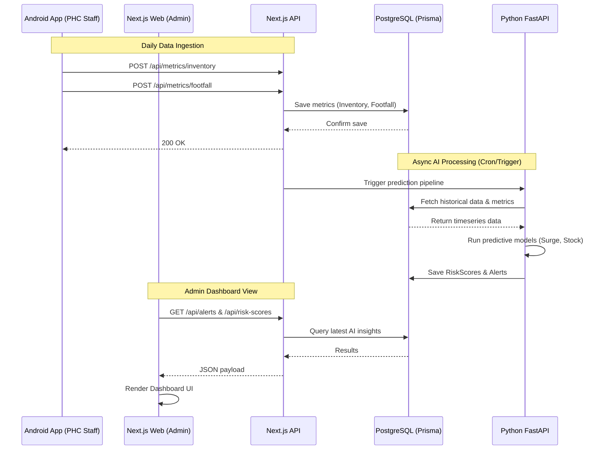
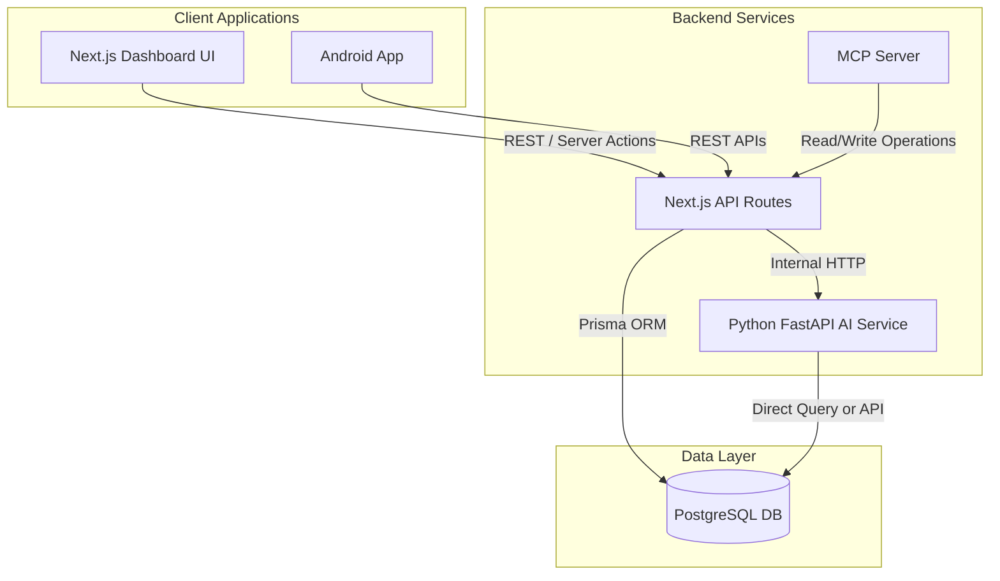

# Low-Level Design (LLD)

This document outlines the detailed component interactions and data flows within the HealthGrid system.

## System Data Flow

## Component Architecture

## Core Modules

1. **Auth Module**: 
   - Handles JWT generation, role-based access control (RBAC). 
   - Ensures PHC staff can only access their specific node, while State Admins see aggregate data.

2. **Ingestion Module**: 
   - Validates incoming data from Android clients.
   - Normalizes data structures (ensuring date consistency, resolving conflicts via `@@unique` constraints on date/phcId).

3. **Analytics & AI Module**:
   - Python-based microservice.
   - Connects to PostgreSQL directly for heavy read operations (Pandas dataframes).
   - Computes output metrics and pushes back to PostgreSQL as `Alert` and `RiskScore` records.

4. **Logistics Module**:
   - Evaluates inventory shortages.
   - Interacts with AI predictions to proactively create `MedicineTransfer` records with `RECOMMENDED` status.
